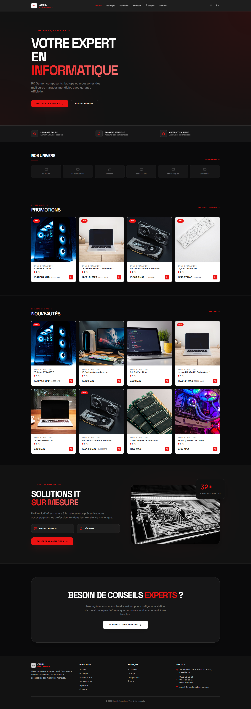

# 💻 Canal Informatique - High-End Tech Online Store

**Canal Informatique** is a premium, full-stack e-commerce platform designed for selling high-end technology products. From networking gear to high-performance workstations, this application provides a seamless shopping experience with a focus on modern aesthetics and smooth user interactions.

## 🌟 Key Features

### 🛒 Customer Experience

- **Dynamic Storefront**: Browse products organized by categories and subcategories.
- **Advanced Filtering**: Quickly find products by universe (Networking, Solutions, etc.).
- **Smart Cart System**: Real-time stock validation and dynamic price updates.
- **Guest Checkout**: Complete orders without needing an account.
- **Premium UI**: Smooth animations using Framer Motion and a high-end dark theme.

### 🛡️ Admin Management

- **Centralized Dashboard**: Manage orders, products, and categories in one place.
- **Order Tracking**: Real-time status updates (Pending, Processing, Shipped, Delivered).
- **Communication Hub**: View and manage customer inquiries directly from the dashboard.
- **Inventory Control**: Update stock levels, prices, and discounts instantly.

## 🛠️ Tech Stack

### Frontend
- **React (Vite)**: Lightning-fast development and optimized production build.
- **Tailwind CSS**: Custom-designed dark premium theme with glassmorphism.
- **Framer Motion**: Fluid micro-animations and page transitions.
- **Lucide Icons**: Crisp, vector-based iconography.
- **Sonner**: High-quality toast notifications.

### Backend
- **Django REST Framework**: Robust API handling and data management.
- **SQLite**: Reliable relational database for project storage.
- **Python**: Core logic and business processing.

---

## 📸 Showcase

### User Interface
The website features a curated dark palette (`#0A0A0B`) with high-contrast elements, providing a sophisticated professional look for a tech-oriented brand.

| Home Page | Boutique | Services |
| :---: | :---: | :---: |
|  |  |  |

| Cart | Checkout | About |
| :---: | :---: | :---: |
|  |  |  |

### Admin Dashboard
A comprehensive management interface allowing administrators to oversee the entire operation with ease and precision.

| Manage Products | View Orders | Manage Categories |
| :---: | :---: | :---: |
|  |  |  |

| Contact Messages | Solutions | Contact Page |
| :---: | :---: | :---: |
|  |  |  |

---

## 🚀 Installation & Setup

> [!NOTE]
> This repository is a showcase containing the project documentation. The full source code is managed in a private repository.

### Prerequisites
- Node.js
- Python 3.x
- Django

---

## 💼 Business & Licensing

Interested in using this template for your business? This high-end e-commerce platform is available for purchase and can be fully customized to fit your brand's unique needs.

### 💰 Acquisition Options
- **Template Purchase**: Get access to the full source code for your own projects.
- **Custom Development**: I can help you extend features, integrate custom APIs, or design a unique brand identity.
- **Support & Hosting**: Assistance with deployment and ongoing technical maintenance.

## 📬 Contact Information

For business inquiries, buying this template, or hiring for custom work, please get in touch:

**Contact Zakaria**: [zakaria0dev.vercel.app/contact.html](https://zakaria0dev.vercel.app/contact.html)

---

Developed with ❤️ by **Zakaria**
